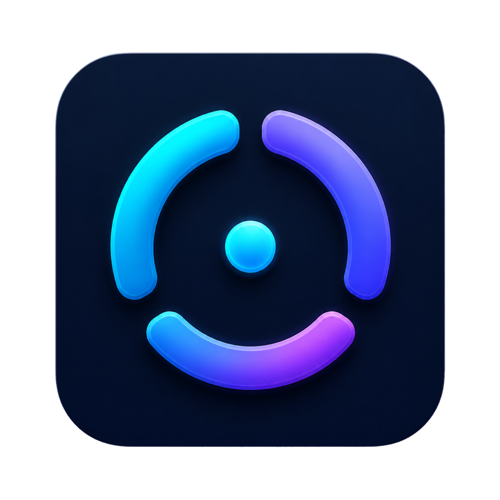

# Codex Meter Mini

<p align="center">
  
</p>

An unofficial, native macOS menu-bar utility that shows the remaining usage for the ChatGPT account currently signed in to Codex.

> [!IMPORTANT]
> Codex Meter is an independent community project. It is not affiliated with, sponsored by, or endorsed by OpenAI.

## What it shows

- The remaining percentage and reset countdown in the menu bar.
- Session and weekly rolling limits in an accessible SwiftUI popover.
- The account plan and credit balance when the local Codex service provides them.
- Automatic refresh every minute by default, with 15-second and 5-minute options.
- Automatic launch at login and recovery after an abnormal exit when installed with `make install`.
- Automatic reconnection when the local Codex service stops responding.

The menu-bar percentage is the **most constrained available limit**: whichever reported window has the lowest remaining percentage. Open the popover to see every available window separately.

On a crowded menu bar—especially a MacBook display with a notch—the label automatically shortens from the full countdown to one reset unit, then to the percentage, and finally to the Codex icon alone when necessary. The complete percentage and reset time remain available in the tooltip, accessibility value, and popover.

The status item has a stable macOS position identifier, so its placement survives restarts and display changes. Hold Command while dragging the item to choose a different permanent position. If you use Ice or another menu-bar manager, keep Codex Meter in that manager's visible section.

## Compatibility notice

Codex Meter launches the locally installed `codex app-server` and reads `account/rateLimits/read`. This interface is experimental and is not a public compatibility promise. A ChatGPT or Codex update may temporarily break the app.

## Privacy

Codex Meter has no analytics, advertising, or independent network client. It communicates with a local `codex app-server` process and keeps returned usage information in memory. The selected refresh interval is stored in macOS `UserDefaults`.

The local Codex process may communicate with OpenAI as part of its normal operation. Codex Meter does not read or store browser cookies, access tokens, API keys, or conversation content.

## Requirements

- macOS 13 or later.
- ChatGPT, Codex, or the Codex CLI installed and signed in.
- Swift 5.9 or later when building from source.
- A full Xcode installation when running the XCTest suite. Command Line Tools alone may not include XCTest.

Codex Meter looks for the executable in the ChatGPT and Codex application bundles, Homebrew locations, and the current `PATH`.

Both the current desktop app layout (`Resources/codex-cli/bin/codex`, with a nested `CodexCLI.app` fallback) and the older `Resources/codex` layout are supported.

## Build and run

```sh
git clone https://github.com/sj-zetic/codex-meter-mini.git
cd codex-meter-mini
make test
make install
```

`make install` builds the app, copies it to `/Applications`, installs a per-user LaunchAgent, and starts it. The agent starts Codex Meter at login and restarts it after an abnormal exit, but respects **Quit Codex Meter**. Run `make uninstall` to remove both the app and agent. The locally built app is ad-hoc signed, so macOS may ask you to confirm the first launch. Public binary distribution requires Developer ID signing and Apple notarization.

## Troubleshooting

### The menu item is missing

- If you built from source, run `make install` so the per-user LaunchAgent can restore Codex Meter after login or an abnormal exit.
- Codex Meter retries placement while macOS settles the new menu-bar layout and automatically shortens its label if the built-in display has less room. If it does not return within several seconds, quit and reopen the app and include your display setup in a bug report.
- Check whether the camera notch or other menu-bar items have pushed it out of view.
- Temporarily close another menu-bar utility to make room.

### Usage is unavailable

- Open ChatGPT or Codex and confirm that you are signed in.
- Confirm that `codex` is installed at one of the supported locations or available on `PATH`.
- Click **Try Again** or use the refresh button after signing in.
- Codex Meter automatically restarts an unresponsive local connection once. If syncing still fails, quit and reopen Codex Meter, then include the displayed error in a bug report.

### A Codex update broke the app

If syncing stopped after a desktop app update, update this repository with `git pull --ff-only` and run `make install` again. Desktop updates can change the bundled CLI location; restarting an older widget will not fix a missing executable path.

Open a bug report with your macOS version, Codex or ChatGPT version, installation method, and the visible error message. Never include tokens, cookies, or other credentials.

## Contributing

Contributions are welcome. Keep changes focused, add tests where practical, and run `swift test` plus `swift build -c release` before opening a pull request. Report vulnerabilities privately as described in [SECURITY.md](SECURITY.md).

## License and trademarks

The source code is available under the [MIT License](LICENSE). The bundled Codex icon is OpenAI artwork, is not covered by the MIT License, and remains subject to OpenAI's applicable trademark and brand terms. See [THIRD_PARTY_NOTICES.md](THIRD_PARTY_NOTICES.md).

OpenAI, ChatGPT, Codex, and the Codex icon are trademarks or other intellectual property of OpenAI. Their use here identifies compatibility with the relevant service and does not imply endorsement.
